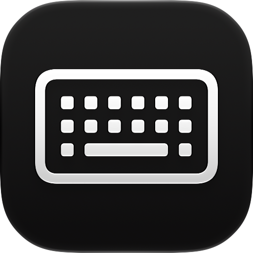

<p align="center">
  
</p>

<h1 align="center">Keyboard Clean Tool</h1>

<p align="center">
  Clean your keyboard without typing a novel by accident.
</p>

<p align="center">
  <a href="https://github.com/yurihbm/keyboard-clean-tool/actions/workflows/test.yml"></a>
</p>

## About

Keyboard Clean Tool is a small macOS app that temporarily disables your keyboard so you can clean it without triggering keystrokes.

### Core mechanism

- Uses a `CGEventTap` to intercept and swallow keyboard events (key down, key up, modifier changes) system-wide while "Cleaning Mode" is active.
- Media keys (volume, play/pause, brightness, etc.) are left untouched.
- If the event tap gets disabled by the system (e.g. due to timeout), it's automatically re-enabled.
- Since intercepting keyboard events system-wide requires elevated access, the app needs **Accessibility permission** to work.
- Localized in English and Brazilian Portuguese.

## Requirements

- macOS 26 or later
- Xcode 27 or later

## Installation

Install via Homebrew:

```sh
brew tap yurihbm/apps
brew install --cask keyboard-clean-tool
```

Keyboard Clean Tool isn't signed or notarized (no paid Apple Developer account yet), so the cask clears the quarantine flag automatically after install — no manual Gatekeeper workaround needed.

## Getting started

1. Clone the repository.
2. Open `KeyboardCleanTool.xcodeproj` in Xcode.
3. Select the `KeyboardCleanTool` scheme and run (`⌘R`).
4. Grant Accessibility permission when prompted (System Settings → Privacy & Security → Accessibility).

## Usage

1. Click **Start Cleaning Mode** to disable the keyboard.
2. Clean your keyboard.
3. Click **Stop Cleaning Mode**, or press **⌥⌘⇧E** at any time to immediately re-enable the keyboard.

The keyboard is also automatically re-enabled if the app quits.

## Project structure

```
KeyboardCleanTool/
├── KeyboardCleanToolApp.swift  # App entry point, owns the AppDelegate
├── KeyboardBlocker.swift       # Owns the CGEventTap lifecycle and blocking state
├── EscapeHatchShortcut.swift   # Matches the ⌥⌘⇧E re-enable shortcut from raw event data
├── SystemDefinedEvent.swift    # Identifies media-key (NX_SYSDEFINED) events
├── ContentView.swift           # The app's UI
├── Localizable.xcstrings       # String catalog (en, pt-BR)
├── AppIcon.icon                 # App icon, built with Icon Composer
└── Assets.xcassets

KeyboardCleanToolTests/   # Unit tests (Swift Testing)
```

## Development

This project follows a test-driven workflow for application logic. `EscapeHatchShortcut` and `SystemDefinedEvent` are pure, dependency-free logic extracted from `KeyboardBlocker`, so the shortcut matching and media-key detection are fully covered by unit tests without touching the real event tap.

Run the full test suite from the command line:

```sh
xcodebuild test -project KeyboardCleanTool.xcodeproj -scheme KeyboardCleanTool -destination 'platform=macOS'
```

Or run tests directly from Xcode with `⌘U`.

### Localization

User-facing strings live in `KeyboardCleanTool/Localizable.xcstrings` (English and Brazilian Portuguese). Add new keys there and reference them by key in SwiftUI views — Xcode's String Catalog editor handles the rest.

### App icon

The app icon is authored with [Icon Composer](https://developer.apple.com/icon-composer/) and lives at `KeyboardCleanTool/AppIcon.icon`. Open it directly in Icon Composer to edit.

## Releasing

Pushing a `v*` tag runs the tests, builds an ad-hoc signed Release archive, publishes it as a GitHub Release, and updates the [Homebrew tap](https://github.com/yurihbm/homebrew-apps) so `brew update` picks it up:

```sh
git tag -m "vX.Y.Z" vX.Y.Z
git push origin vX.Y.Z
```

See `AGENTS.md` for what the CI does under the hood. Claude Code users can just run `/release`.
